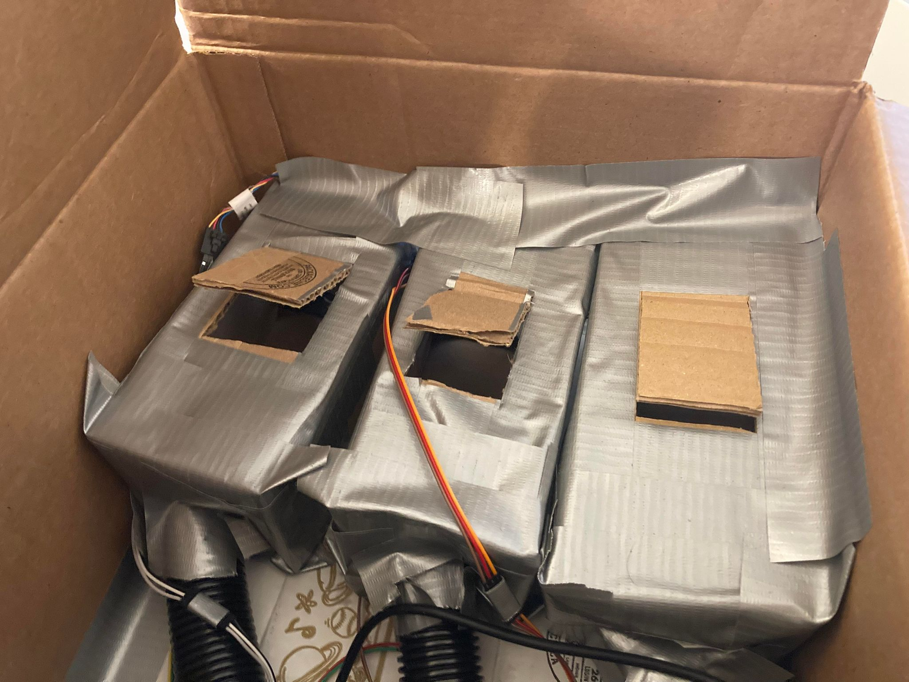

# Smell Kiosk

Group Members: Andrew Lu, Xingbu Qin, Vivian Ross

## Overview

The goal of this project is to augment the sense of smell. To this end, we decided to create a digital ordering kiosk for a hypothetical smoothie shop. Just as current ordering kiosks allow a customer to order and pay for a meal, our smoothie kiosk would allow customers to select between different flavors of smoothies. However, in addition to just ordering a smoothie, our kiosk would allow a customer to smell the different available flavors in order to get an idea of what their smoothie might taste like. 

Our project also has a research component. We are curious as to how large an effect visual and olfactory cues have on a person's perception of taste. We are planning to test this using our smell delivery system and various flavors of water. Our hypothesis is that delivering a smell that does not match the flavoring of the water will confuse a user and cause them to perceive a taste that is different from the flavoring we provided. In addition, we are planning to use food coloring to test whether the visual appearance of a drink affects a user's perception of its flavor.

    

## Design

There were several factors to consider in designing our smell delivery system. Our first design decision concerned what scents to use. We decided early on that we wanted to use scents relating to food so that we could use the scents to examine the effect on a user's sense of taste. We initially tried using simple food items such as pieces of fruit as our source of scent. However, we found that food alone did not have a scent strong enough for a user to reliably smell. Therefore, we turned to a variety of other sources, including soaps, lotions, and essential oils. With all of these sources, we were limited to using existing scents we could purchase, which severely limited our selection. We eventually discovered fruit-scented essential oils, after which we settled on the idea of creating a smoothie kiosk. The essential oils we ended up using have strong and recognizable scents, which makes them ideal for use in our project.

Our next concern was figuring out how to deliver individual scents to the user. We were worried about effectively controlling what a user smells and clearing an old scent from the air prior to delivering a new scent. We initially considered imitating [Meta Cookie's](https://www.exploratorium.edu/blogs/fabricated-realities/meta-cookie-olfactory-gustatory-augmented-reality) design in using small tubes to deliver scents directly to a user's nose. Upon experimenting with tubing, we found that it was extremely difficult to reliably deliver a scent directly to a user's nose through small tubing due to the difficulty of directing the correct amount of air through a narrow tube. Instead, we found that simply blowing a fan over an open bottle of essential oil effectively directed that scent in the direction of the airflow. As a result, we settled on the design of placing the open bottle of essential oil into a chamber. The chamber has a fan blowing through it into a funnel that directs the airflow into a large tube. The tube can then be pointed towards a user's face to facilitate smelling the oil.

In spite of our initial concern regarding clearing the air prior to delivering a new scent, we found that a scent effectively cleared on its own if we did not actively blow it towards a user. Therefore, we did not feel it necessary to implement a complex system to clear a scent. Instead, we simply added an exhaust fan separate from the others in order to blow unscented air towards a user and further clear the scent. 

Although we purchased 11 flavors of essential oil, we settled on the following 6 flavors, which we chose for their recognizability and popularity in smoothies.

* Pineapple
* Mango
* Strawberry
* Banana
* Orange
* Peach

## Implementation

The bulk of our project was hardware based. We used seven computer fans to deliver and clear scents. We controlled the fans using an Arduino Uno with a pulse-width modulation (PWM) signal that controlled the fan speed. In order to communicate with the Arduino Uno to toggle different fans, we developed an Android app on Android studio. The application consists of a carousel of smoothie selections, each one connected to a specific configuration of fans. Selecting a flavor causes the application to communicate with the Arduino over Bluetooth and turn on the corresponding fans.

    
    
    
    
    
    

# Experiment Procedure

## Experiment 1: Food Coloring (Vision, Smell, and Taste)

Prepare two drinks: one sip of sparkling water with orange food coloring and one sip of sparkling water with yellow food coloring. Turn the orange scent on and make sure the user can smell it. Hand them the drink, telling them it's flavored, and make sure the user can see the color of their drink. Have them take a sip while smelling the orange scent, without telling them what they're smelling or showing them the tablet screen. Ask what flavor they think it is. If they respond that they cannot taste the flavor, record this but ask them what flavor they would guess if they were forced to guess.

## Experiment 2: Flavored Water (Smell and Taste)

Prepare two servings of lemonade. Hand the user the drink, telling them it's flavored, and make sure the user can smell the scent we turn on. For the first serving, turn on orange (in hopes of fooling them since both lemons and oranges are citrus fruits) and for the second serving turn on strawberry (in hopes of making them think it's strawberry lemonade). In both cases, ask them what flavor they think they're tasting.

## Experiment 3: Scent Identification

Blow each scent to the user one at a time. Ask the user to identify each scent and record responses. Give the user a hint by informing them that each scent is a fruit, and repeat the procedure again.

## Miscellaneous

Ask the user how we can improve our experiment for the future.

# Experiment Results

## Experiment 1 Results

| Color | Participant 1 | Participant 2 | Participant 3 | Participant 4 |
| ----- | ------------- | ------------- | ------------- | ------------- |
| Yellow | Lemon | Bubblegum | Seltzer | |
| Orange | Lemon | Coconut | Seltzer | |

As shown, one participant was influenced by the yellow color to think that the first yellow drink was lemon flavored. However, this participant found the following orange drink to taste the same. Other participants were unaffected by the color, with one participant correctly identifying the drink as seltzer. One participant may have been influenced by the sweet smell in tasting bubblegum and coconut flavors.

## Experiment 2 Results

| Scent | Participant 1 | Participant 2 | Participant 3 | Participant 4 |
| ----- | ------------- | ------------- | ------------- | ------------- |
| Orange | Lemonade | Lemon | Lemon | |
| Strawberry | Lemonade | Lemon/Lime | Sugary Lemon | |

As shown, the smell had no effect on the participants' perception of the taste of the drink. All of them tasted the lemonade flavor.

## Experiment 3 Results

No Hint:

| Scent | Participant 1 | Participant 2 | Participant 3 | Participant 4 |
| ----- | ------------- | ------------- | ------------- | ------------- |
| Mango | Vanilla/Play Doh | Coconut/Pina Colada | Fresh Air/Citrus | |
| Orange | Vanilla Lotion | Blossom | Wood Cleaner | |
| Pineapple | Brown Sugar/Cinnamon | Vanilla/Coconut | Coconut/Pineapple | |
| Strawberry | Birthday Cake | Rose/Bubblegum | Guava | |
| Peach | No Idea | Apple | Poop/Flowers | |
| Banana | Root Beer | Bubblegum/Candy | Artificial Banana | |

Hint:

| Scent | Participant 1 | Participant 2 | Participant 3 | Participant 4 |
| ----- | ------------- | ------------- | ------------- | ------------- |
| Mango | Banana | Orange | Strawberry | |
| Orange | Lemon | Strawberry | Orange | |
| Pineapple | Cooked Apple | Banana | Banana | |
| Strawberry | Banana | Grape | Mango | |
| Peach | Pear | Apple | Peach | |
| Banana | Banana | Pear | Banana | |

As shown, without being told that the flavors were all fruits, participants could not identify the scents at all. Even after knowing that the scents were fruits, they still did not correctly identify a majority of the scents. Participants commented that the scents were very artificial and difficult to identify. This may explain our poor results in the previous experiments.
